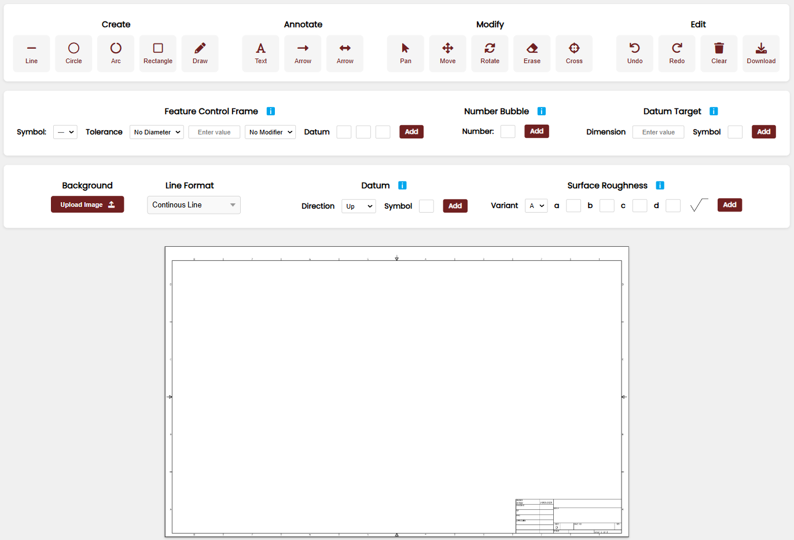

# 2D Online CAD Drawing Tool  

A lightweight **2D online CAD drawing tool** built with **Vanilla JavaScript**, **CSS**, and an **HTML Canvas**. This tool provides an intuitive interface for creating, annotating, and modifying technical drawings directly in the browser. Designed for seamless integration into the **Excedify** website, it offers essential CAD functionalities for engineers, designers, and students.  

---



---

## Features  


### Core Functionalities  
- **Create**:  
  - Draw geometric shapes: `Line`, `Circle`, `Arc`, and `Rectangle`.
    
- **Annotate**:  
  - Add `Text`, `Arrows` and `Double-Arrows`.
    
- **Modify**:  
  - `Move`, `Rotate`, `Erase`, `Pan`, add `Center Cross` and interact with existing shapes.
     
- **Edit**:  
  - `Undo`, `Redo`, `Clear` the canvas, or `Download` your drawing as an image.
     

### Specialized Features  
- **Feature Control Frames (FCFs)**:  
  - Include geometric dimensioning and tolerancing (GD&T) specifications.
     
- **Datum**:  
  - Add datum references for accurate alignment and technical details.
     
- **Datum Targets**:  
  - Specify control points on the drawing for precision.
    
- **Number Bubbles**:  
  - Label and organize drawing elements with customizable numbered callouts.
    
- **Surface Roughness**:  
  - Add surface quality symbols for manufacturing specifications.
    

### Advanced Tools   
- **Freehand Drawing**:  
  - Create custom shapes and annotations effortlessly.
    
- **Scaling**:  
  - Resize shapes proportionally.
    
- **Panning**:  
  - Navigate the canvas and drawings.
     

### Layout and Canvas Features  
- Organized toolbars for **Create**, **Annotate**, **Modify**, and **Edit** functionalities.
  
- Predefined templates with title blocks for professional layouts.
  
- A **landscape canvas** with a 1:1.414 aspect ratio (A-series paper dimensions).  

---

## Installation  

1. Clone the repository:  
   ```bash  
   git clone https://github.com/your-username/2D-CAD-Drawing-Tool.git
2. Navigate to the project directory: 
   ```bash  
   cd Online-CAD-Drawing-Tool
3. Open the index.html file in any modern browser to use the tool.
